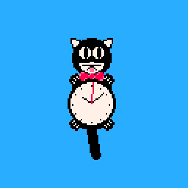

# KLOCK

This is a cat clock built with Pico-8. This was built as part of a creative programming exercise @ [The Recurse Center](https://recurse.com). The prompt was, "ways of telling time".

Additonal inspiration by [xclock -mode cat](https://github.com/BarkyTheDog/catclock)

## Demo

You can [try it out on itch.io](https://manila.itch.io/klock)
